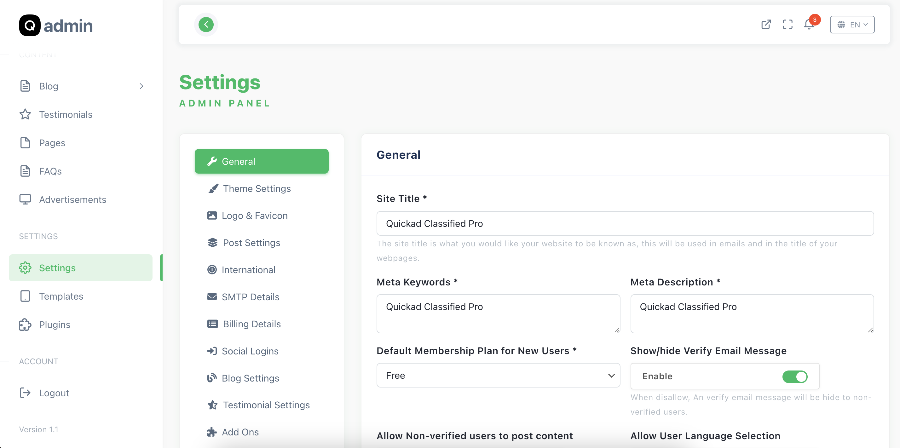
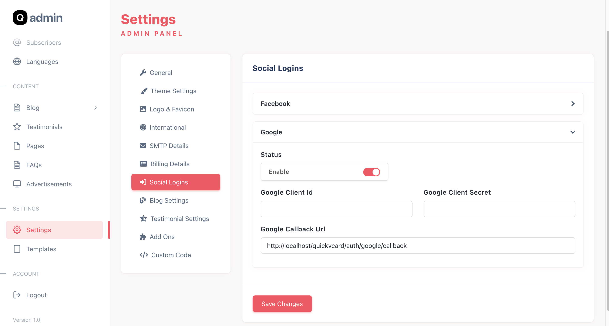

# QuickAd Classified Ads Script

Este repositório contém o script QuickAd para anúncios classificados, configurado para execução em containers Docker.


## 📋 Funcionalidades

- 📢 Sistema completo de anúncios classificados
- ⚙️ Interface administrativa robusta
- 🌍 Suporte a múltiplos idiomas
- 💳 Integração com gateways de pagamento
- 👤 Sistema de usuários e perfis

## 🏗️ Arquitetura

O projeto utiliza Docker Compose para orquestrar os serviços. Abaixo está o diagrama da arquitetura:

```mermaid
graph TD
    User[Usuário / Navegador] -->|HTTP:8000| Nginx[Nginx (Web Server)]
    Nginx -->|PHP-FPM:9000| App[App (PHP 8.1)]
    App -->|TCP:3306| DB[(MySQL 8.0)]

    subgraph Docker Network
    Nginx
    App
    DB
    end
```

## 🖼️ Screenshots

### Configurações Gerais


### Login Google


## 🚀 Instalação e Execução

### Pré-requisitos
- Docker
- Docker Compose

### Passos

1. Clone este repositório:
   ```bash
   git clone <url-do-repositorio>
   cd quickad-docker
   ```

2. Execute os containers:
   ```bash
   docker-compose up --build -d
   ```

3. Acesse a aplicação:
   - **Frontend**: http://localhost:8000
   - Siga o assistente de instalação no primeiro acesso.

## 💾 Configuração do Banco de Dados

O container MySQL vem pré-configurado:

| Variável | Valor Padrão |
|----------|--------------|
| Database | `quickad`    |
| User     | `quickad`    |
| Password | `password`   |
| Root Pwd | `rootpassword`|

⚠ *Você pode alterar essas credenciais no arquivo `docker-compose.yml`.*

## 📂 Estrutura do Projeto

```
.
├── script/              # Código fonte da aplicação Laravel
│   ├── core/            # Core do Framework
│   └── ...
├── nginx/               # Configuração do servidor Web
├── Documentation/       # Documentação e screenshots
├── docker-compose.yml   # Orquestração dos containers
└── Dockerfile           # Definição da imagem PHP
```

## 🛠️ Desenvolvimento

O volume do código fonte já está mapeado no `docker-compose.yml` para permitir desenvolvimento em tempo real:

```yaml
volumes:
  - ./script:/var/www
```

Qualquer alteração na pasta `script/` será refletida imediatamente no container.

## 🤝 Suporte

Este script foi modificado para remover verificações de código de compra. Para suporte técnico, consulte a documentação original ou a comunidade.

## 📄 Licença

Consulte os termos da licença original do QuickAd.
